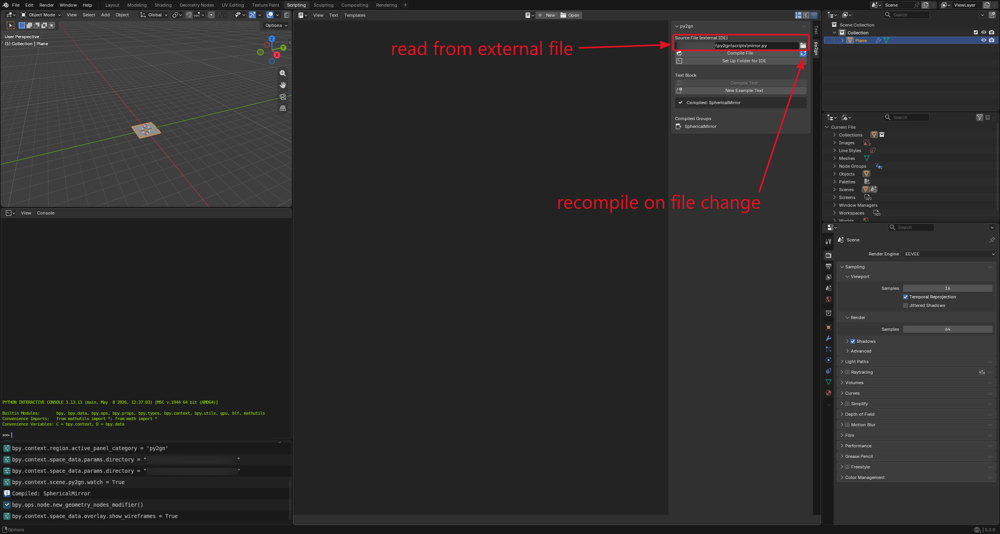
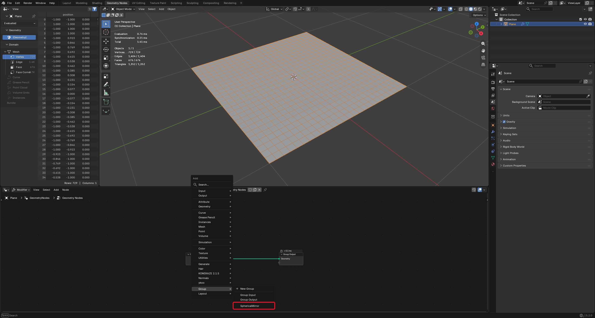
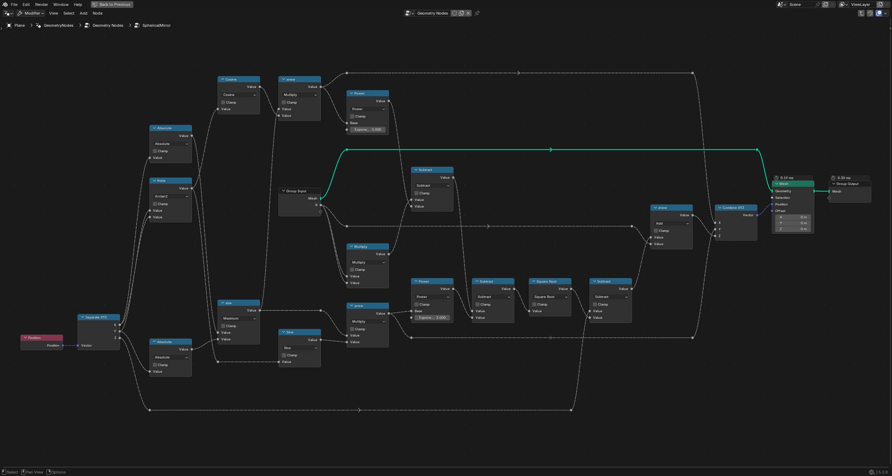
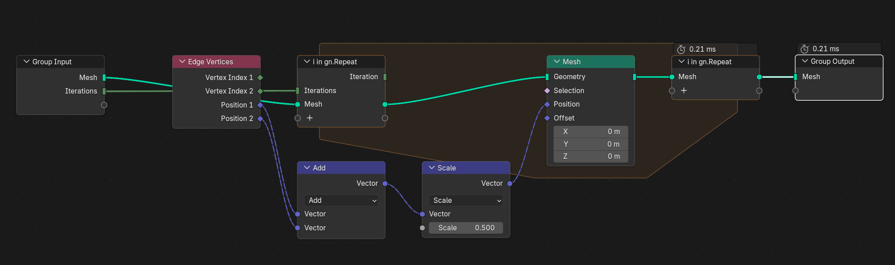
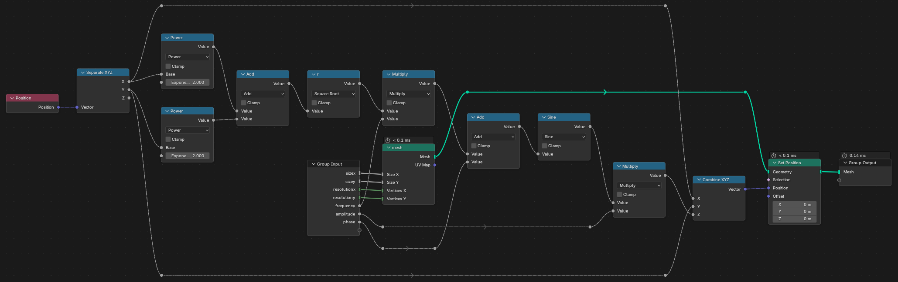

# `py2gn`

Blender add-on that compiles restricted Python functions into **native Geometry Nodes groups**. Parameters become input sockets, return values become output sockets, and the body becomes Math / Vector Math / Compare / Switch / geometry nodes, so the result is field-aware and as fast as hand-built nodes (no Python runs at evaluation time).

> Not all of the geometry nodes are supported yet: see [NODES.md](NODES.md) for the full list of currently implemented nodes.

```python
import py2gn.lang as gn


def solidify(
    mesh: gn.tGeometry, thickness: float = gn.Param(1.0, min=0, description="Thickness")
) -> gn.tGeometry:
    inner = gn.FlipFaces(mesh)
    outer, _, side = gn.ExtrudeMesh(mesh, offset=gn.Normal, scale=thickness, individual=False)
    outer = gn.StoreNamedAttribute(outer, "side", side, domain="FACE")
    return gn.JoinGeometry(inner, outer)
```

## Using it

- **Text Editor -> Sidebar -> py2gn -> Compile Text** compiles every top-level `def` in the active text block into a node group of the same name.
- **Source File** (also in the Geometry Node Editor sidebar): point it at a `.py` file and press **Compile File**, or toggle the refresh button to **recompile on every save**. Edit the file in any IDE.
- **Set Up Folder for IDE** writes `pyrefly.toml`, `ruff.toml` and `.vscode/settings.json` next to the source file (existing files are kept), pointing at this checkout's `.venv`, for completion, hover docs and full type checking against `py2gn.lang`.
- Errors report `file:line` in the panel and the Blender console (clickable in VS Code's terminal); in the Text Editor the cursor jumps to the line.
- Recompiling updates groups **in place**: sockets whose name and type are unchanged keep their identity, so links in trees that use the group survive. Groups not created by py2gn are never overwritten.

|  |  |
| :-----------------------------: | :--------------------------------: |
| Set an external file path to watch | Compiled geometry nodes should be available in the node editor |

## Features

> Note, for demonstration purposes, nodes where beautified with the `NodeArrange` add-on, the actual groups produced by the code might look different.

<details>
<summary>
Complex math expressions
</summary>

```python
def SphericalMirror(
    Mesh: gn.tGeometry,
    R: float = gn.Param(1, min=0, description="Radius of curvature"),
) -> gn.Outputs(Mesh=gn.tGeometry):
    pos = gn.Position
    theta = gn.Atan2(pos.y, pos.x)
    size = gn.Max(gn.Abs(pos.x), gn.Abs(pos.y))
    xnew, ynew = size * gn.Cos(theta), size * gn.Sin(theta)
    znew = pos.z - gn.Sqrt(R * R - xnew**2 - ynew**2) + R
    Mesh = gn.SetPosition(Mesh, gn.tVec(xnew, ynew, znew))
    return Mesh
```



</details>

<details>
<summary>
For loops (`Repeat`)
</summary>

```python
def Smooth(
    Mesh: gn.tGeometry,
    Iterations: int = gn.Param(10, min=0, description="Number of iterations"),
) -> gn.Outputs(Mesh=gn.tGeometry):
    for i in gn.Repeat(Iterations):
        _, _, p1, p2 = gn.EdgeVertices()
        Mesh = gn.SetPosition(Mesh, 0.5 * (p1 + p2))
    return Mesh
```



</details>

<details>
<summary>
For loops (`For each element`)
</summary>

</details>

<details>
<summary>
Inlined functions
</summary>

```python
# Note: you may also define the function to be inlined in the global scope:
#
# @gn.inline
# def wave(pos: gn.tVec, frequency: float, amplitude: float, phase: float) -> gn.tVec:
#     r = gn.Sqrt(pos.x**2 + pos.y**2)
#     return gn.tVec(pos.x, pos.y, gn.Sin(r * frequency + phase) * amplitude)


def Wavy(
    sizex: float = 1,
    sizey: float = 1,
    resolutionx: int = 10,
    resolutiony: int = 10,
    frequency: float = 10,
    amplitude: float = 0.1,
    phase: float = 0.0,
) -> gn.Outputs(Mesh=gn.tGeometry):
    mesh, _ = gn.Grid(sizex, sizey, resolutionx, resolutiony)

    def wave(pos: gn.tVec, frequency: float, amplitude: float, phase: float) -> gn.tVec:
        r = gn.Sqrt(pos.x**2 + pos.y**2)
        return gn.tVec(pos.x, pos.y, gn.Sin(r * frequency + phase) * amplitude)

    return gn.SetPosition(mesh, wave(gn.Position, frequency, amplitude, phase))
```



</details>

## Naming convention

| | Spelling | Examples |
| --- | --- | --- |
| Built-ins | only through the namespace alias | `import py2gn.lang as gn` (any alias; `gn` is assumed if a file has no import) |
| Nodes, fields | PascalCase of Blender's node name | `gn.JoinGeometry`, `gn.StoreNamedAttribute`, `gn.EvaluateAtIndex`, `gn.Position`, `gn.Index` |
| Multi-output inputs | node name + output name; or the node as a tuple | `gn.SplineParameterLength`; `factor, length, index = gn.SplineParameter()` |
| Math | conventional names, PascalCase | `gn.Sin`, `gn.Clamp`, `gn.Dot`, `gn.Mix`, `gn.Pi` |
| Socket types | `t` prefix | `gn.tFloat`, `gn.tInt`, `gn.tBool`, `gn.tVec`, `gn.tGeometry` (Python's `float`, `int`, `bool` work too) |
| Keyword arguments / options | snake_case / UPPERCASE strings | `selection=`, `domain="FACE"`, `mode="WILDCARD"` |
| **Bare names** | **always yours** | parameters, locals, functions of the file, node groups of the .blend; plus Python's `float`, `int`, `bool`, `range` |

So nothing can collide: a parameter called `Index`, a function called `Sin` or a node group called `JoinGeometry` are simply yours, and the built-ins stay reachable as `gn.Index`, `gn.Sin`, `gn.JoinGeometry`. Old spellings and typos get hints (`undefined name 'position' -- ... gn.Position`, `gn has no 'Positon' -- did you mean gn.Position?`).

## Language

| | |
| --- | --- |
| Types | `float` (default), `int`, `bool`, `gn.tVec`, `gn.tGeometry`. Defaults (including `gn.tVec(0, 0, 1)`, `gn.Pi`) become socket defaults. |
| Outputs | single value -> `Result`; `return a, b` -> outputs `a`, `b`; `return gn.Outputs(radius=r, angle=t)` names them; annotations (`-> float`, `-> gn.Outputs(n=int)`) force socket types. |
| Operators | `+ - * / // % **`, `@` (dot), comparisons (chained), `and or not`, `a if c else b`, `.x .y .z` |
| Statements | assignment / tuple unpacking / `+=`; `if / elif / else` (merged into Switch nodes); `for i in gn.Repeat(n)` (one Repeat zone); `for i, element, *values in gn.ForEachElement(...)` (one For Each Element zone); `for` over compile-time sequences (`range`, lists, `enumerate`, `zip`: unrolled); nested `def` / `lambda` and `@gn.inline` functions (expanded inline); calls to your functions / node groups by bare name |
| Math | `Sin Cos Tan Asin Acos Atan Atan2 Sinh Cosh Tanh Sqrt InverseSqrt Exp Log Abs Floor Ceil Round Trunc Fract Sign Radians Degrees Pow Min Max FMod Mod Snap PingPong Wrap Clamp Mix`, `Pi Tau E` (vector variants where Blender has them) |
| Vectors | `gn.tVec(x, y, z)`, `gn.tVec(s)`, `Length Dot Cross Normalize Distance Project Reflect` |
| Fields | `Position Normal CurveTangent Index ID Radius IsSplineCyclic`; `SplineParameter()` or `SplineParameterFactor SplineParameterLength SplineParameterIndex`; `EdgeNeighbors`; `EdgeVertices()` or `EdgeVerticesVertexIndex1 EdgeVerticesVertexIndex2 EdgeVerticesPosition1 EdgeVerticesPosition2`; `SceneTime()` or `SceneTimeSeconds SceneTimeFrame`; `EvaluateAtIndex(value, index, domain)`, `EvaluateOnDomain(value, domain)` |
| Attributes | `NamedAttribute("name", type)`, `NamedAttributeExists("name")`, `StoreNamedAttribute`, `RemoveNamedAttribute` |
| Geometry | `MeshCircle Grid CurveCircle BezierSegment QuadraticBezier InstanceOnPoints RealizeInstances IndexSwitch SetPosition JoinGeometry MeshBoolean MeshBevel SeparateGeometry DeleteGeometry SplitEdges MergeByDistance DuplicateElements CaptureAttribute PointsToCurves SetSplineCyclic ReverseCurve ResampleCurve CurveToMesh MeshToCurve MeshToPoints ExtrudeMesh FlipFaces` |
| Mesh topology (fields) | `EdgesOfVertex CornersOfVertex CornersOfEdge CornersOfFace FaceOfCorner VertexOfCorner EdgesOfCorner OffsetCornerInFace` |
| Sampling (fields) | `SampleIndex(geo, value, index, domain, clamp)`, `SampleNearest(geo, sample_position, domain)` |
| Queries (single values) | `DomainSize(geo, domain, component)`, `AttributeStatistic(geo, value, stat, domain, selection)` |

`lang.py` is the authoritative reference: every name with its signature and documentation.

### Group-input settings

Write them as the parameter's default with `gn.Param`:

```python
def Wall(
    Height: float = gn.Param(2.0, min=0, max=10, subtype="DISTANCE", description="Wall height"),
    Angle: float = gn.Param(gn.Pi / 4, subtype="ANGLE"),
    Dir: gn.tVec = gn.Param(gn.tVec(0, 0, 1), min=-1, max=1, subtype="DIRECTION"),
    Count: int = gn.Param(4, min=1, description="Merlons per edge"),
): ...
```

- `min` / `max`: float, int and vector inputs (vectors per component).
- `subtype`: float `FACTOR PERCENTAGE ANGLE DISTANCE TIME TIME_ABSOLUTE MASS WAVELENGTH COLOR_TEMPERATURE FREQUENCY PIXEL`, int `FACTOR PERCENTAGE PIXEL`, vector `TRANSLATION DIRECTION VELOCITY ACCELERATION EULER XYZ FACTOR PERCENTAGE PIXEL`.
- `description`: the tooltip, for any input.

Defaults can be constant expressions (`gn.Pi / 4`, `gn.tVec(0, 0, 2 * gn.Pi)`). Everything is validated against the input's type: invalid subtypes, `min > max`, and defaults outside the range are errors. Settings left out are reset on recompile, so the source stays the single truth; links to the group's sockets survive.

### Nodes with several outputs

They return a named tuple: unpack it, or pick one output by name (Blender's socket name in PascalCase).

```python
corner, total = gn.CornersOfVertex(gn.Index, weights=level)
face = gn.FaceOfCorner(corner).FaceIndex
mesh, top, side = gn.ExtrudeMesh(mesh, offset=up)  # or gn.ExtrudeMesh(...).Top
```

Using one where a single value is expected is an error that lists the outputs.

### Compile-time Python

Everything that shapes the graph runs while compiling; the values flowing through can be fields or geometry:

```python
corners = [gn.tVec(0, 0, 0), gn.tVec(1, 0, 0), gn.tVec(1, 1, 0)]
for i, c in enumerate(corners):  # unrolled
    mesh = gn.StoreNamedAttribute(mesh, f"TEMP_c{i}", gn.Position + c)


def polys(sel, prefix, k):  # local helper: expanded at each call
    pts = gn.MeshToPoints(mesh, selection=sel)  # sees `mesh` as it is at the call
    m = gn.RealizeInstances(gn.InstanceOnPoints(pts, gn.MeshCircle(k, fill="NGON")))
    return gn.SetPosition(
        m,
        gn.IndexSwitch(
            gn.Index % k, *[gn.NamedAttribute(f"TEMP_{prefix}{i}", type=gn.tVec) for i in range(k)]
        ),
    )
```

Supported: lists and tuples (literals, `+`, `*`, indexing, slicing, `.append`, `.extend`), `for` over `range` / lists / `enumerate` / `zip` / `reversed` (unrolled; no `break`/`continue`), list comprehensions and generator expressions (with `if` filters), f-strings and string concatenation (anywhere a name or option string is expected), `*args` spreading in calls, `len`, `list`, `tuple`, `str`, nested `def` and `lambda` (expanded inline, seeing the enclosing variables when called), and `if`s on compile-time conditions (no Switch node).
- **Must be known while compiling:** loop counts, list indices, strings and conditions that pick between compile-time values. Values computed by nodes (fields, `gn.DomainSize(...)`) can't drive these; for a loop whose count comes from nodes, use `gn.Repeat` (below).
- **Number formatting:** integral numbers format without `.0` (`f"a{i}"` gives `a0`).
- **Discarded results are errors:** a call whose result is thrown away (`gn.FlipFaces(mesh)` without `mesh = `) is reported.

### Repeat loops

```python
x = gn.Position.x
for i in gn.Repeat(n):  # one Repeat zone; n may be computed, e.g. gn.DomainSize(mesh)
    x = x * 2 + i  # i: the iteration index
mesh = gn.StoreNamedAttribute(mesh, "x", x)
```

`for ... in gn.Repeat(n)` builds the body **once**, inside a Repeat zone, instead of unrolling copies.
- **Loop state:** variables assigned in the body that exist before the loop become the zone's items (fields, values, vectors or geometry), and hold the final values afterwards. Their type is fixed by the value before the loop. Everything else assigned in the body is local to it, and the body can read anything from outside.
- **The count must be a single value**, not a per-element field.
- **When to use which loop:** a plain `for` over a compile-time sequence still unrolls. That's the right choice when iterations differ structurally (different attribute names, different helpers), which a zone can't express. `gn.Repeat` is for repeating the same step, especially many times or a computed number of times.

### For-each loops

```python
each = gn.ForEachElement(mesh, gn.Position, domain="FACE", selection=sel)  # fields read per element
for i, element, center in each:  # index, the element's own geometry, the values
    each.result(height=center.z * 2)  # one value per element -> a field after the loop
    each.generate(gn.SetPosition(gn.MeshCircle(6, radius=0.1), offset=center), source=i)
mesh = gn.StoreNamedAttribute(each.Geometry, "h", each.height, domain="FACE")
dots = each.Generated  # all generated geometry, joined (each.source lives on it)
```

`gn.ForEachElement` builds one *For Each Geometry Element* zone; the body is built once and runs for every element of `domain`.

- **Inside the loop**, the index, the element and the values of the given fields are single values. That's why `if i % 2 == 0:` may choose between geometries.
- **Iterations are independent**, so nothing assigned in the body carries over.
- **Outputs** come from two calls, which must sit at the top level of the body, not inside an `if`:
  - `each.result(name=value)` produces per-element values, which become fields on `each.Geometry` after the loop;
  - `each.generate(geometry, name=field)` adds geometry to `each.Generated`. Several calls are joined; one call can carry fields.
- **Each loop object can be iterated once.**

### Inline functions

```python
@gn.inline
def lerp(a, b, t: float = 0.5):
    return a + (b - a) * t
```

`@gn.inline` makes no node group: each call expands the body into the calling function's graph. Use it for small helpers you don't want as separate groups.
- **Generic:** parameters without an annotation accept anything, so `lerp` works for floats *and* vectors.
- **Annotations still apply where they matter:** `gn.tVec` promotes scalars like a vector socket would, and `gn.tGeometry` requires geometry.
- **Calls and placement:** inline functions can call each other (not recursively) and can be defined anywhere in the file.
- **Checked on use only:** an inline function that's never called isn't compiled. Errors inside one point at its own line and name the call site.

Any other decorator is an error.

### Semantics worth knowing

- **Fields are lazy.** A field passed to a geometry node is evaluated on *that node's* geometry. `p = gn.Position` followed by `gn.SetPosition(...)` and then `gn.StoreNamedAttribute(..., p)` stores the *moved* position; use `mesh, p = gn.CaptureAttribute(mesh, gn.Position)` to freeze it.
- **Both branches always run.** Conditionals become Switch nodes; a "guard" like `x if x > 0 else gn.Log(x)` does not prevent `Log` from being evaluated (Blender's math nodes return 0 instead of failing).
- **Geometry `if`s need a single-value condition** (one choice for the whole geometry). Field conditions are rejected; use a `selection=` argument for per-element choices.
- Float `==` uses the Compare node's default epsilon (0.001). `AttributeStatistic` standard deviation / variance are population statistics (÷N). Out-of-range `EvaluateAtIndex` reads zero.

## Install (editable)

All helper scripts live in `scripts/` and work from any directory. Run them from the checkout root, as shown.

```powershell
.\scripts\install.ps1 5.2 -Enable     # link into Blender 5.2's extensions, enable, save preferences
.\scripts\install.ps1 5.2 -Uninstall  # remove the link (the checkout is never touched)
.\scripts\install.ps1                 # list Blender versions that have a config directory
```

This creates a junction `%APPDATA%\Blender Foundation\Blender\<version>\extensions\user_default\py2gn` -> this checkout (`scripts/install.sh` makes a symlink on Linux/macOS).
- **Re-running is safe.** A link pointing elsewhere is only replaced with `-Force`, and a real directory (a zip install) is never replaced.
- **Close that Blender version before `-Enable`**, or its own preferences autosave will undo it.

## Your function files

Keep them in `temp/`: it's gitignored and never packaged, but inside the checkout, so the project's pyrefly/ruff config applies and editing there gets full completion and type checking.

```powershell
.\scripts\check.ps1 temp\my_funcs.py            # ruff + pyrefly
.\scripts\check.ps1 temp\my_funcs.py -Compile   # + compile in a background Blender (factory settings)
```

`-Compile` catches what types can't (e.g. a field used as a geometry `if` condition). Then paste the file into a text block (**Compile Text**), or point **Source File** at it.

## Development

```powershell
.\scripts\setup_venv.ps1      # .venv (Python 3.13 like Blender 5.2) with fake-bpy-module, ruff, pyrefly
.venv\Scripts\ruff check .
.venv\Scripts\pyrefly check
.\scripts\run_tests.ps1       # tests in a background Blender, factory settings (-Feature <group>)
.\scripts\package.ps1         # build the extension .zip into the checkout root
.\scripts\update_node_list.ps1  # regenerate the node checklist in NODES.md
```

Linux/macOS: the same scripts with `.sh` (`./scripts/setup_venv.sh`, `./scripts/run_tests.sh --blender /path/to/blender`, ...).

Use **F3 -> Reload Scripts**, or the *Blender Development* VS Code extension (`Blender: Start`, then breakpoints work; reloads on save), to pick up code changes.

### Layout

| Path | |
| --- | --- |
| `compiler/` | language implementation, no UI: `names` (public names, convention), `values` (types), `tables` (built-ins), `builder` (AST → nodes), `analysis` (field dependency), `interface` (socket sync), `params` (defaults, `gn.Param`), `compile` (entry points), `reference` (plain-Python semantics for tests) |
| `ui/` | settings, operators, panels, on-save watcher, IDE folder setup |
| `lang.py` | the language as a typed module, for editors (`import py2gn.lang as gn`) |
| `examples/functions.py` | examples (also used by *New Example Text*) |
| `tests/` | integration tests run inside Blender against independent reference values (`run_tests.py`, called by `scripts/run_tests.*`) |
| `scripts/` | `install`, `check`, `setup_venv`, `run_tests`, `package`, `update_node_list` (`.ps1` and `.sh`) |
| `tools/` | `compile_check.py` (used by `scripts/check.* -Compile`), `node_checklist.py` (generates NODES.md) |
| `temp/` | your function files (gitignored) |
| `docs/` | images |

---

### Disclaimer
This code was written in-part with the help of Claude Code.